# How to handle Dates and Times in SAS Event Stream Processing

The tutorial talks about various ways of working with dates and times in ESP

## Table of Contents
* [Overview](#overview)
    - [Key Takeaways](#key-takeaways)
* [ESP Date and Time data types](#esp-date-and-time-data-types)
    - [Model and Output](#model-and-output)
    - [Points to Consider](#points-to-consider)
* [Date Time handling by underlying engines in ESP](#date-time-handling-by-underlying-engines-in-esp)
    - [Dataflux Expression Engine](#dataflux-expression-engine)
        - [Model and Output](#model-and-output-1)
        - [Points to Consider](#points-to-consider-1)
    - [Micro Analytic Service (MAS)](#micro-analytic-service-mas)
        - [Model and Output](#model-and-output-2)
        - [Points to Consider](#points-to-consider-2)
*	[Functional window handling time](#functional-window-handling-time)
    - [Out of box conversion from Stamp and Date data type to Int64 type and vice versa](#out-of-box-conversion-from-stamp-and-date-data-type-to-int64-type-and-vice-versa)
      -	[Model and Output](#model-and-output-3)
    - [Conversion of date time string to date stamp types](#conversion-of-date-time-string-to-date-stamp-types)
      - [Model and output](#model-and-output-4)
      - [Points to Consider](#points-to-consider-3)
    - [Conversion of date stamp type to date time string](#conversion-of-date-stamp-type-to-date-time-string)
      - [Model and output](#model-and-output-5)
      - [Points to Consider](#points-to-consider-4)
*	[Date time handling in connectors and adapters](#date-time-handling-in-connectors-and-adapters)
    - [Model and output](#model-and-output-6)
*	[Time and time zone considerations](#time-and-time-zone-considerations)
    - [timeGmtToLocal(time)](#timegmttolocaltime)
    - [timeGmtString(argument1, argument2)](#timegmtstringargument1-argument2)
    - [Points to Consider](#points-to-consider-5)
      - [Model and output](#model-and-output-7)
* [Calculations Involving Dates](#calculations-involving-dates)
    - [Model and output](#model-and-output-8)
*	[Best Practices](#best-practices)
*	[Conclusion](#conclusion)


## Overview
SAS Event Stream Processing provides multiple ways to work with dates and times.  Based on how the overall data stream is structured, ESP uses different internal languages and engines to handle the dates and times accordingly.

This document talks about various ways of processing dates and times in ESP with example models. We have also provided explanations to help you to navigate through some of the common scenarios one can face when working with such diverse data. 

Each explanation below comes with a snapshot of sample output generated by running the corresponding models. The sections also point to the models which you can run on your systems to check the results yourselves.

### Key Takeaways
- Learn ways to publish data containing dates and times to ESP.
- Learn how ESP handles dates and times internally.
- Some of the best practices to follow while working with such data.
- Know some considerations while working with dates and times.


## ESP Date and Time data types
SAS Event Stream Processing supports two data types to handle date and time types.

- STAMP: Data of Stamp type is stored internally as Int64 type in ESP. It is processed as number of microseconds since epoch.
- DATE: Data of Date type is also stored internally as Int64 type in ESP. It is processed as seconds since epoch.

Note: SAS Event Stream Processing saves all time values relative to the UNIX epoch time (00:00 UTC on January 1, 1970).

### Model and Output
Below is a snapshot of the model used for illustration:
<figure align="center">
  
  <figcaption><i>Fig 1. Model for Date and Time data types</i></figcaption>
</figure>

You can find the model for reference here:
https://github.com/sassoftware/iot-how-to-handle-dates-times-ESP/tree/main/models/Project_TimeDataTypes.xml

Below is the snapshot of an event in Studio which shows Date type field and Stamp type field with formatting and their corresponding Int64 values.
<figure align="center">
  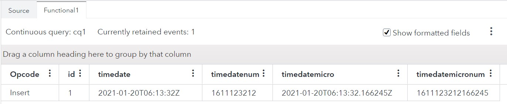
  <figcaption><i>Fig 2. Output for date time data type handling in ESP</i></figcaption>
</figure>

- **timedate** is my current time as a Date field.
- **timedatenum** is the value of timedate field stored in ESP.
- **timedatemicro** is the current time as Stamp field
- **timedatemicronum** is the value of timedatemicro field stored in ESP

Note: ESP Studio shows all the dates and times in UTC time zone by default
Note: You can know more about how to publish events into ESP with date formatting in the Connectors and Adapters section.

### Points to Consider
One of the common mistakes done when working with date time types is not assigning the correct data to the underlying data types. If you assign anything other than microseconds to the Stamp data type, then your corresponding date will be wrong.
Below is the snapshot of date shown by ESP Studio when value of Date type is assigned to Stamp type.
<figure align="center">
  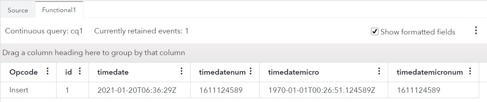
  <figcaption><i>Fig 3. Output for Date type value assigned to Stamp type</i></figcaption>
</figure>

- **timedate** is the current time as a Date field.
- **timedatenum** is the value of timedate field stored in ESP.
- **timedatemicro** is the current time as Stamp field
- **timedatemicronum** is the value of timedatemicro field stored in ESP

Notice that timedatemicronum has same value as timedatenum field. However, notice the value is timedatemicro field. The year is different from timedate field. This is because timedatemicro field expects value in microseconds and converts that into date time format. So, 1611124589 microseconds since epoch is 1970-01-01T00:26:51.124589Z.
You can face a similar issue when you assign Stamp type data to Date type.

## Date Time handling by underlying engines in ESP
ESP leverages a couple of engines to support external languages for data processing. The engines are

- Dataflux Expression Engine
- Micro Analytic Service (MAS)

### Dataflux Expression Engine
Event stream processing applications can use expressions to define the following:

- filter conditions in Filter windows
- non-key field calculations in Compute, Aggregate, and Join windows
- matches to window patterns in events of interest
- window-output splitter-slot calculations 

The expression language uses a different time format, saving the value as a number. The number represents days since 12/30/1899. Hours, minutes, seconds, and milliseconds are converted to a fraction, where 1 hour = 1/24 units, 1 minute = 1/(24*60) units, and so on.
SAS Event Stream Processing converts between the UNIX epoch format and the expression language format when date or time values are used. To modify the value in the expression language, use the expression language format.

#### Model and Output
Below is a snapshot of the model used for illustration:
<figure align="center">
  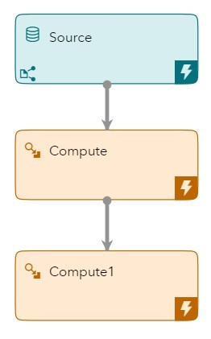
  <figcaption><i>Fig 4. Model for Date and Stamp type handling in Expression engine</i></figcaption>
</figure>

You can find the model for reference here:
https://github.com/sassoftware/iot-how-to-handle-dates-times-ESP/tree/main/models/Project_TimeExpression.xml

Below we have the output from the Source window to show what data is going to the Expression Engine for calculations.
<figure align="center">
  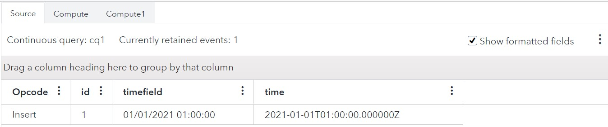
  <figcaption><i>Fig 5. Output from Source window</i></figcaption>
</figure>

- **timefield** is a string representation of date and time.
- **time** is the value of timefield formatted to Stamp data type 

Below is the output that we get from the Compute Window when the date is 01/01/2021 01:00:00.
<figure align="center">
  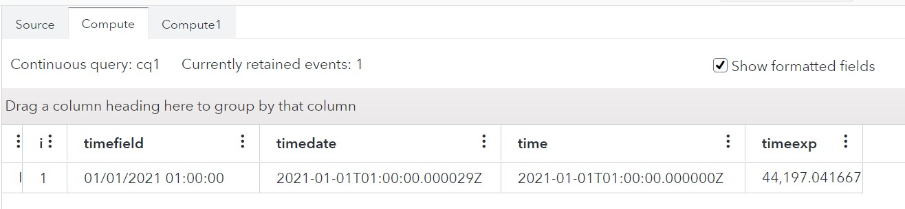
  <figcaption><i>Fig 6. Output from expression engine for given date</i></figcaption>
</figure>

- **timefield** is a string representation of  a given date and time.
- **timedate** is the timefield converted automatically by the expression engine into Stamp data type
- **time** is the timefield as it is from Source window output.
- **timeexp** is the representation of time field in Expression Language as fraction of days. This implements the following expression   
`toreal(time)`, where   
`toreal` converts the internal date time type of Expression Engine to double type to show how the time data is handled in expression engine

#### Points to Consider
The Date time value that you get after processing by Expression engine may not be exactly same as expected, specially the time part.  
If you notice in the model above, the value of timedate field, it has 29 microseconds more. You may be guessing from where this came. Let’s looks at the calculation that the conversion between ESP and Expression Engine.
01/01/2021 is 44197 days since 12/30/1899.  
Now we need to convert the hour part. So, 01 will be 1/24 days which comes out to be 0.041666666666666………. This is rounded off to 0.041666667. The 29 microsecond is because of the rounding off that is done on converting the fraction back to microsecond. In this case 0.041667 is days in fraction. If we convert it into microseconds, then we will multiply it with 24*3600000000 which comes out to be 3,600,000,028.8 microseconds.

## Micro Analytic Service (MAS)
When you use SAS Micro Analytic Service modules with DS2 or Python, the date or time value is not converted into native formats. Instead, the value is converted into SAS epoch format, which starts at January 1, 1960. The value is passed as a BIGINT for DS2 and a long for Python.
The difference between the UNIX epoch and SAS epoch times is as follows:  
- EPOCH_DIFF_SECONDS: 315619200
- EPOCH_DIFF_MICROSECONDS: 315619200000000
Note: If the ESP dates are written to CAS then also this difference in epochs must be considered as CAS also follows SAS epoch.

### Model and Output
Below is the snapshot of the model used for this illustration:
<figure align="center">
  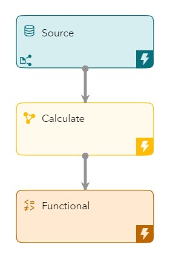
  <figcaption><i>Fig 7. Model to illustrate Date and Time handling through MAS in DS2</i></figcaption>
</figure>
You can find the model for reference here:
https://github.com/sassoftware/iot-how-to-handle-dates-times-ESP/tree/main/models/Project_TimeDS2.xml

Below we have the output from the Source window to show what data is going through the MAS engine to DS2 code:
<figure align="center">
  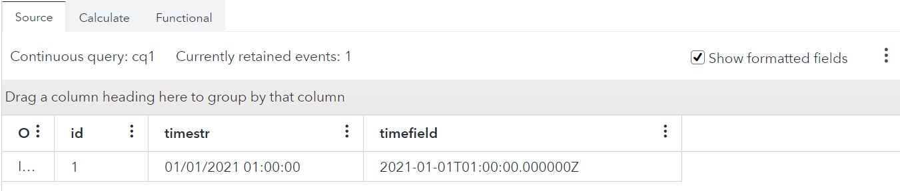
  <figcaption><i>Fig 8. Output from Source Window</i></figcaption>
</figure>

- **timestr** is a string representation of date and time.
- **timefield** is the value of timestr formatted to Stamp data type 

Below is the corresponding output from the Calculate window.
<figure align="center">
  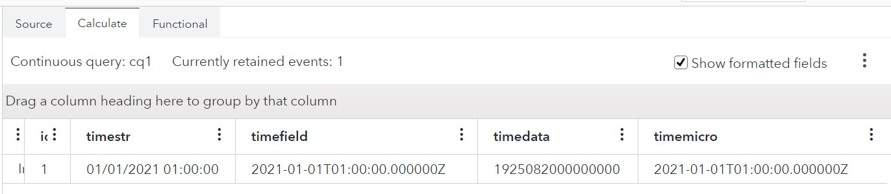
  <figcaption><i>Fig 9. Output from Calculate window by the DS2 code</i></figcaption>
</figure>

- **timestr** is a string representation of date and time.
- **timefield** is the value of timestr formatted to Stamp data type 
- **timedata** is of Int64 type which represents the underlying value that the DS2 code gets for the stamp type.
- **timemicro** is of Stamp type as returned by DS2.

The corresponding DS2 code is:
```
ds2_options sas;
package loadResults/overwrite=yes;
method getResultSet(bigint timefield, in_out bigint timedata, in_out bigint timemicro);
	timedata = timefield;
	timemicro = timefield;
end;
endpackage;
```
You can see the code simply assigns the stamp values passed to two fields, timedata and timemicro.

### Points to consider
If we convert the timedata field above into Stamp data type in a Functional Window then let’s see the output.
<figure align="center">
  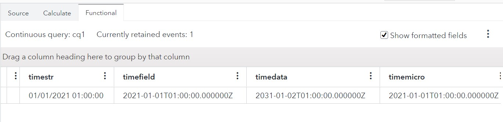
  <figcaption><i>Fig 10. Output of Calculate window passed through the following Functional Window </i></figcaption>
</figure>

- **timedata** is of Stamp type which represents the underlying value that the DS2 code gets for the stamp type.

Note that the year of timedata is off by 10 years. This is because that’s how MAS converts ESP timestamps by adding 10 years to compensate for the SAS epoch time.
Similar conversion happens for Python code too. 
Below is the Python code that will give the same result as above.

```
from datetime import datetime
import datetime

def getResultSet(timefield):
	"Output: timedata, timemicro"
	timedata = timefield
	timemicro = timefield
	return timedata,timemicro
```
Note: In a Python program that obtains the UNIX epoch time from an input date value, subtract 315619200 from that value while processing the data.

## Functional window handling time
Functional window deals with underlying integer directly to work with the Date and Stamp types. It provides multiple ways to process various date time data.

### Out of box conversion from Stamp and Date data type to Int64 type and vice versa
Functional window can automatically convert Date and Stamp types to their underlying Int64 type. This can be especially helpful in case of processing input data in timestamps as Date or Stamp types.

#### Model and Output
Below is the snapshot of the model used for illustration:
<figure align="center">
  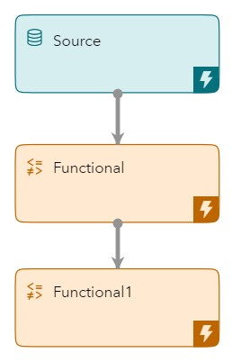
  <figcaption><i>Fig 11. Model for showing how Functional Window handles Date and Stamp data types </i></figcaption>
</figure>
You can find the model for reference here:  
https://github.com/sassoftware/iot-how-to-handle-dates-times-ESP/tree/main/models/Project_TimeFunctional.xml

The output from the Source window is below.
<figure align="center">
  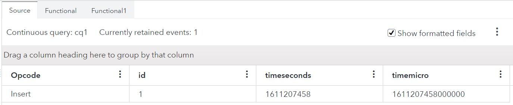
  <figcaption><i>Fig 12. Output from Source window</i></figcaption>
</figure>

- **timeseconds** is number of seconds since epoch as integer
- **timemicro** is number of microseconds since epoch as integer

The output from the Functional window getting the above input is as below:
<figure align="center">
  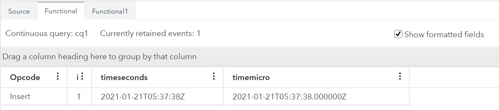
  <figcaption><i>Fig 13. Output from Functional window getting converting INT64 types to Date and Stamp types</i></figcaption>
</figure>

- **timeseconds** is of Date type for the timeseconds field of Source window
- **timemicro** is of Stamp type for the timemicro field of Source window

If we pass the same data to another Functional Window with Int64 type data then the output is as below:
<figure align="center">
  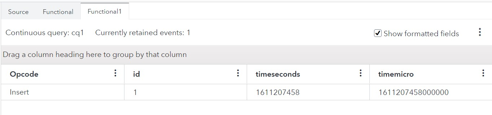
  <figcaption><i>Fig 14. Output from Functional1 window that convert Date and Stamp types to Int64 types</i></figcaption>
</figure>

- **timeseconds** is Int64 type for the timeseconds field from Functional window
- **timemicro** is Int64 type for the timemicro field from Functional window

You can see this is same as Source window output.

NOTE: This conversion does not change the date and time that we noticed in Expression Language or using MAS modules as it works directly on the underlying numeric value. 

### Conversion of date time string to date stamp types
Functional window provides multiple functions also to deal with date time types. To convert a date time string into ESP date time types you can use timeParse function. The usage is as below:  
+  `timeParse(time ,<format >)`  
time is the date and time in string format that needs to be converted  
format is supported by the UNIX strftime function.  You can get more info on the formats here (https://man7.org/linux/man-pages/man3/strftime.3.html)  
Converts the supplied string to seconds since epoch  

Note: The function ignores any milli or microseconds part of the data.

#### Model and Output
Below is the snapshot of the model used for illustration:
<figure align="center">
  
  <figcaption><i>Fig 15. Model for showing conversion of date time string into Date and Stamp type</i></figcaption>
</figure>
You can find the model for reference here:
https://github.com/sassoftware/iot-how-to-handle-dates-times-ESP/tree/main/models/Project_TimeParse.xml

Below we see the output from the Source window of the above model
<figure align="center">
  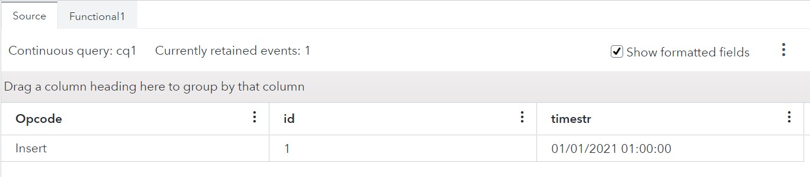
  <figcaption><i>Fig 16. Output from Source window</i></figcaption>
</figure>

- **timestr** is the date time in string type

The output from the Functional window getting the above input is as below
<figure align="center">
  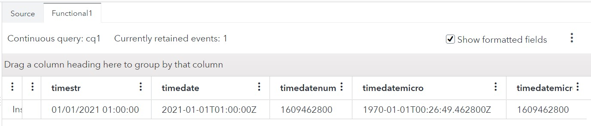
  <figcaption><i>Fig 17. Output from Functional window applying functions</i></figcaption>
</figure>

- **timestr** is the time in string which is same as the input
- **timedate** is the Date type field which has a corresponding Function of timeParse($timedata,'%m/%d/%Y %H:%M:%S')
with date format as '%m/%d/%Y %H:%M:%S'
- **timedatenum** is the numeric equivalent of the timedate value to give you an understanding of the conversion
- **timedatemicro** is the output from timeParse function for a Stamp data type
- **timedatemicronum** is the numeric equivalent of the timedatemicro field.

#### Points to Consider
The output from timedatemicro above is not correct. This is because timeparse converts the date into seconds while timedatemicro expects microseconds. This you can verify by comparing the values of timedatmicronum and timedatenum fields which are same.  
To fix the above error with timedatemicro field we need to further process the output of timeParse function. Check the output below.
<figure align="center">
  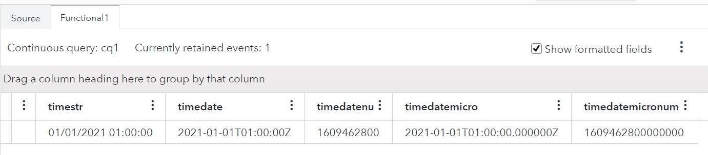
  <figcaption><i>Fig 18. Converting date time strings to Stamp data type</i></figcaption>
</figure>

- **timestr** is the time in string which is same as the input
- **timedate** is the Date type field which has a corresponding Function of timeParse($timedata,'%m/%d/%Y %H:%M:%S')
with date format as '%m/%d/%Y %H:%M:%S'
- **timedatenum** is the numeric equivalent of the timedate value to give you an understanding of the conversion
- **timedatemicro** is the Stamp field which has a corresponding function of 
`timeMicro(timeParse($timestr,'%m/%d/%Y %H:%M:%S'))`
`timeMicro converts the seconds into microseconds`
- **timedatemicronum** is the numeric equivalent of the timedatemicro field.

**How to handle microseconds!!!**
As seen in the above examples any value below the seconds granularity is ignored by the timeParse function as it converts the string into seconds. Below we will see an example how we can extract the part below seconds granularity from a date time string.

For a model like above, the Source window output is as below
<figure align="center">
  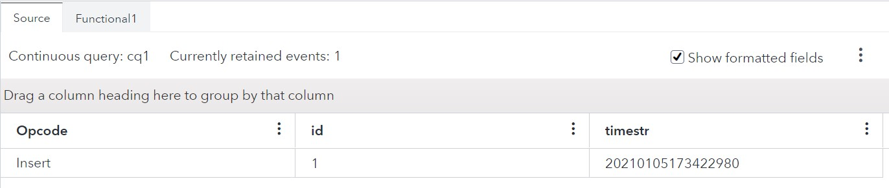
  <figcaption><i>Fig 19. Source window output for a date time string containing millisecond data</i></figcaption>
</figure>

- **timestr** is a string representation of the time till milliseconds. The value above represents year: 2021, month: 01, day: 05, hour: 17, minutes: 34, seconds: 22 and 980 milliseconds.

The source window output acts as input to a Functional window. The Functional Window Output is as below:
<figure align="center">
  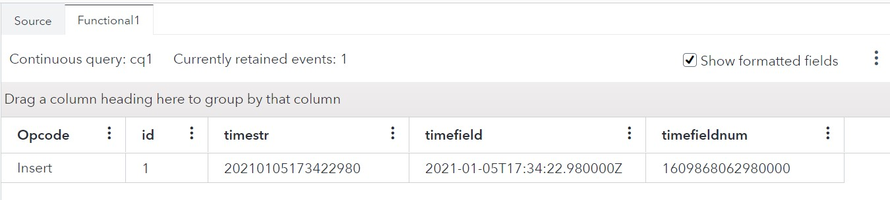
  <figcaption><i>Fig 20. Output from Functional window</i></figcaption>
</figure>

- **timestr** is the same as the input time in string.
- **timefield** is the corresponding ESP Stamp type. This is achieved through the following function:  
`sum(timeMicro(timeParse($timestr ,'%Y%m%d%H%M%S')),product(number(substring($timestr,14,6)),1000))`  
`timeParse($timestr ,'%Y%m%d%H%M%S'))` converts the string into seconds by applying the strftime format
`timeMicro(timeParse($timestr ,'%Y%m%d%H%M%S'))` converts the seconds into micro seconds  
`substring($timestr,14,6)` extracts the millisecond part from the string which is the last 3 characters  
`number(substring($timestr,14,6))` converts the string into numbers  
`product(number(substring($timestr,14,6)),1000))` multiplies the number by 1000. Effectively it is converting the milliseconds into microseconds.  
`sum(timeMicro(timeParse($timestr ,'%Y%m%d%H%M%S'))`,product(number(substring($timestr,14,6)),1000))
adds the two components from the time (seconds converted into microseconds and milliseconds converted into microseconds) to get the exact value of the string in microseconds.
- **timefieldnum** is the corresponding value in Int64 for the timefield

Above we had to extract the part below seconds granularity from the string separately and do mathematical operation to add it to the seconds part. Based on how the time string is given the above function can be modified to achieve the corresponding Stamp type data.

###	Conversion of date stamp type to date time string
To convert a date stamp ESP type into date time string you can use timeString function. The usage as below:  
+ `timeString(time ,<format >)`
time is the numeric time value or Date type  
format is supported by the UNIX strftime function.  You can get more info on the formats here (https://man7.org/linux/man-pages/man3/strftime.3.html)  
Converts the supplied time to string in the format supplied.  
Time needs to be in seconds since epoch.

NOTE: The timeString function ignores any fraction part of seconds that one may use to specify milli or microseconds.

#### Model and Output
Below you can find the model used for this illustration.
<figure align="center">
  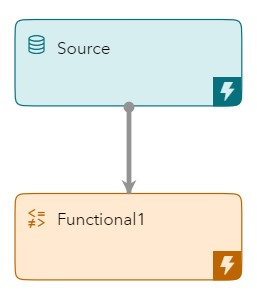
  <figcaption><i>Fig 21. Model for showing Date and Stamp type conversion to date time formatted string</i></figcaption>
</figure>
You can find the model for reference here:
https://github.com/sassoftware/iot-how-to-handle-dates-times-ESP/tree/main/models/Project_TimeString.xml

First the output from Source window.
<figure align="center">
  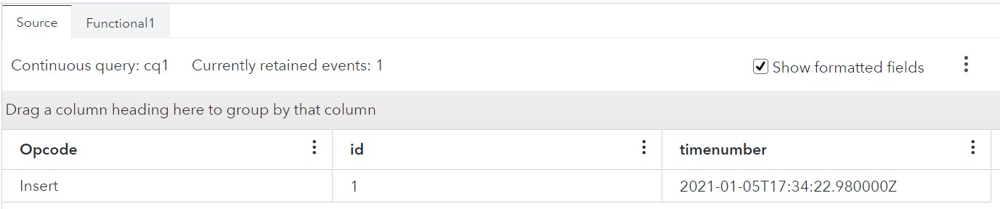
  <figcaption><i>Fig 22. Source window output to show conversion of Date Time stamp to string</i></figcaption>
</figure>

- **timenumber** is the time in Stamp format

The output above acts as an Input for the next Functional Window. The output for the Functional Window is as below:
<figure align="center">
  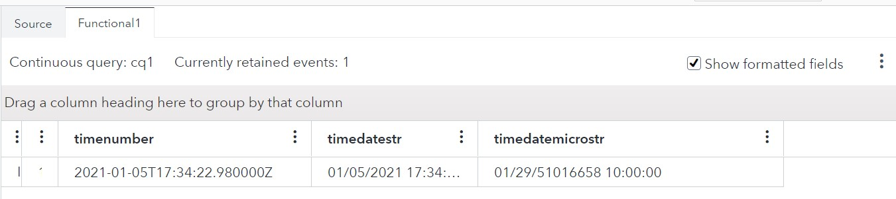
  <figcaption><i>Fig 23. Output from Functional window</i></figcaption>
</figure>

- **timenumber** is the field from input as it is.
- **timedatestr** is the string representation of timenumber in the format ‘'%m/%d/%Y %H:%M:%S’
This field uses the following function:  
`timeString(quotient($timenumber,1000000),'%m/%d/%Y %H:%M:%S')`, where
`quotient($timenumber,1000000)` converts the microseconds into seconds
- **timedatemicrostr** is the string representation of timenumber keeping it in microseconds. It uses the function  
`timeString($timenumber,'%m/%d/%Y %H:%M:%S')`  
Note the value of the year. This is because timeString expects the time in seconds whereas here we are passing microseconds. That is why we need to remove the microsecond part.

Note: You can see the fraction part is ignored by timeString.

#### Points to Consider
**How to handle microseconds!!!**

To include the microseconds part in the date time string we need to do some more processing.  
For the same input above check the output for the Functional Window
<figure align="center">
  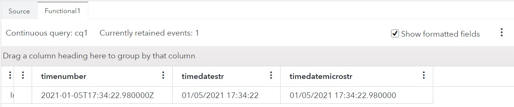
  <figcaption><i>Fig 24. Output from Functional Window with microsecond processing</i></figcaption>
</figure>

- **timenumber** is the same as input from Source window
- **timedatestr** is the corresponding date in seconds
- **timedatemicrostr** is the corresponding date including the microseconds part as fraction. It uses the following function  
`concat(timeString(quotient($timenumber,1000000),'%m/%d/%Y %H:%M:%S'),'.',substring($timenumber,diff(stringLength($timenumber),6)))`  
`timeString(quotient($timenumber,1000000),'%m/%d/%Y %H:%M:%S')` converts the time till seconds into the date format  
`substring($timenumber,diff(stringLength($timenumber),6))` extracts the microseconds part from the time by processing the underlying time as string  
`concat(……….)` simply concats the date part and the fractional part.

## Date time handling in connectors and adapters
Connectors and adapters can convert between a human readable timestamp, such as 01/01/2021 01:00:00 AM and the UNIX epoch time. For connectors and adapters that can convert time, a dateformat key exists that describes the format of the date or time value.
- For connectors and adapters that are written in C++, this format is in strftime. 
- For adapters written in Java, this format is in Java 8 SimpleDateFormat.( https://docs.oracle.com/javase/8/docs/api/java/text/SimpleDateFormat.html)

NOTE: All connectors are written in C++ and any adapter for which a corresponding connector exists is also written in C++.  
For fields that are defined as a Stamp type, microsecond precision is supported. Neither strftime nor SimpleDateFormat support microseconds with the format string. For times with a second’s value that includes a period, the value after the period is converted to microseconds.

### Model an Output
Below you can find the model used for this illustration.
<figure align="center">
  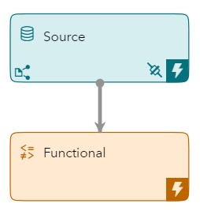
  <figcaption><i>Fig 25. Model for showing Date and Stamp type conversion by connector</i></figcaption>
</figure>
You can find the model for reference here:
https://github.com/sassoftware/iot-how-to-handle-dates-times-ESP/tree/main/models/Project_ConnectorTime.xml

The output from the Source window is as follows:
<figure align="center">
  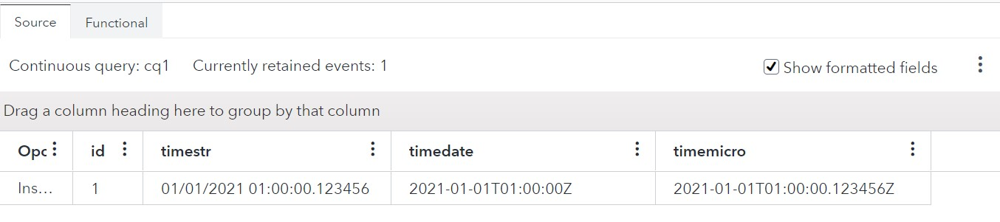
  <figcaption><i>Fig 26. Output from Source window for time converted by file and socket connector</i></figcaption>
</figure>

- **timestr** is the string format of the date time being read from a file using file and socket connector. The microseconds are defined as the fraction part of seconds.
- **timedate** is the Date type for the same data as timestr. The string has been converted property into seconds since epoch with the fraction part being ignored
- **timemicro** is the Stamp type for the same data as timestr. The microseconds in the fraction part are properly converted into timestamp since epoch by the connector.

You can refer to the connector properties below:
<figure align="center">
  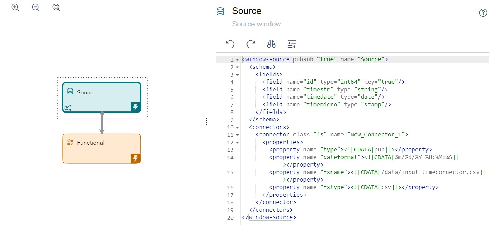
  <figcaption><i>Fig 27. File and socket publisher connector properties for the dateformat</i></figcaption>
</figure>
Notice the dateformat supplied in the connector properties.

One thing to note is that a similar dateformat when supplied in a Functional Window in the timeParse function does not convert to microseconds. This is because timeParse always converts the data into seconds. You can see it below in the output of the Functional Window for the same input.
<figure align="center">
  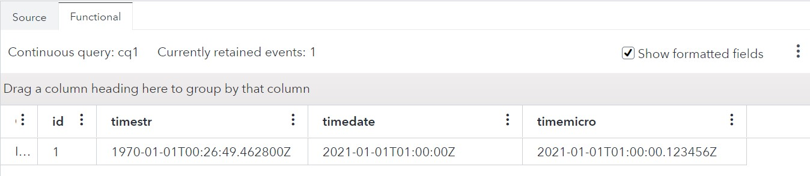
  <figcaption><i>Fig 28. Output from functional window with dateformat</i></figcaption>
</figure>

- **timestr** here is the Stamp data type applied for the timestr field coming from Source window above. The function applied is  
`timeParse($timestr,'%m/%d/%Y %H:%M:%S')`

Even though the dateformat is the same the output is different because timeParse is converting the data into seconds for the timestr field which is Stamp type and expects microseconds.  

The same concept will work for subscriber connector/adapters too. For the Source window above the output of the subscriber file connector is as below:

| timestr | timedate | timemicro |
| ------ | ------ | ------ |
| 01/01/2021 01:00:00.123456 | 01/01/2021 01:00:00 | 01/01/2021 01:00:00.123456 |

Notice that the Stamp type has been converted back into the original string while the Date type is missing the microsecond fraction which is normal as it represents data till seconds granularity.

For reference the configuration of the Subscriber connector is as below:
<figure align="center">
  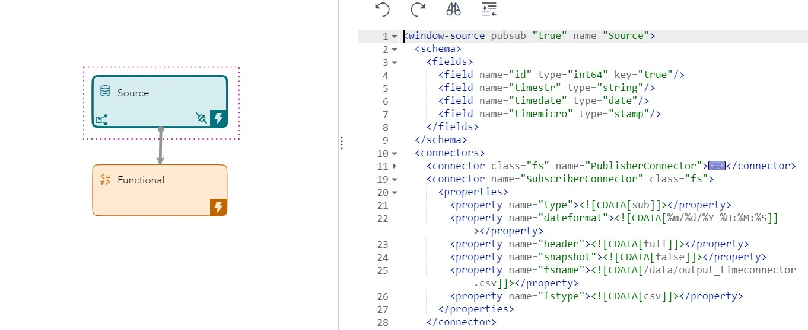
  <figcaption><i>Fig 29. Subscriber connector properties for file and socket connector</i></figcaption>
</figure>

## Time and time zone considerations
In ESP all date and time data are converted to Coordinated Universal Time (UTC), no matter how time-stamped by its source. This you can easily notice by printing the current timestamp in a Functional Window.  
You can get the models used here for your reference at:  
https://github.com/sassoftware/iot-how-to-handle-dates-times-ESP/tree/main/models/Project_CurrentTime.xml  
https://github.com/sassoftware/iot-how-to-handle-dates-times-ESP/tree/main/models/Project_CurrentTimeString.xml  

The output from a Functional window printing the current time in microseconds is as below:
<figure align="center">
  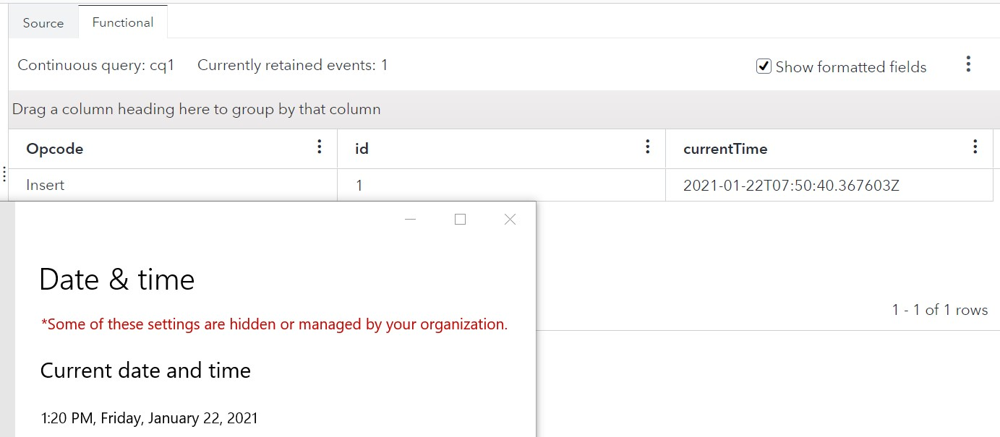
  <figcaption><i>Fig 30. Output from Functional window showing current Time</i></figcaption>
</figure>

- **currentTime** is of Stamp data type which uses systemMicro function to print the current timestamp. Notice the output is different from the system time being shown below. The difference is exactly the difference between UTC time and the current timezone.

Functional window provides two functions for conversion between the UTC times and the local times.

### timeGmtToLocal(time)
This function converts the time in seconds (assuming it to be in UTC) to time in current time zone. So, it works on Date data type fields. If you have Stamp data type then you have to process the data for this.  

An example for the output is below:
<figure align="center">
  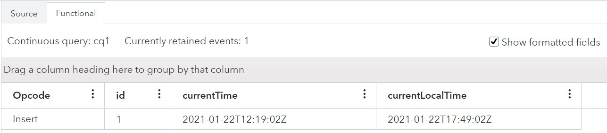
  <figcaption><i>Fig 31. Output from Functional window for timeGMTtoLocal function</i></figcaption>
</figure>

- **currentTime** is Date type which shows the output of function timeCurrent(). This is in UTC.
- **currentLocalTime** is Date type which implements the following function 
`timeGmtToLocal(timeCurrent())`  
This gives the output in local timezone.

### timeGmtString(argument1, argument2)
This function converts the localtime in argument1 to GMT time and output it in the date format mentioned in argument2. Again, this also works only on seconds and having microseconds will require processing.

An example of the output is as below:
<figure align="center">
  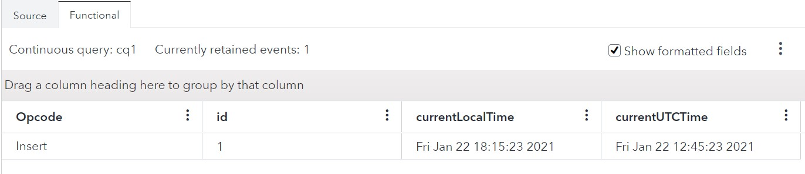
  <figcaption><i>Fig 32. Output from Functional window for timeGmTString function</i></figcaption>
</figure>

- **currentLocalTime** is string type and gives the formatted time in my timezone. This uses the function:  
`timeString(timeCurrent())`
- **currentUTCTime** is string type and gives the formatted time in UTC. This uses the function:  
`timeGmtString(timeCurrent())`

### Points to Consider
Wherever using expression engine, to remain consistent with SAS Event Stream Processing times, use the todayGMT() function instead of the today() function when you create a date field in the expression language.

#### Model and Output
Below is the model to show the above behavior.
<figure align="center">
  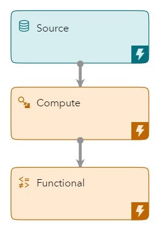
  <figcaption><i>Fig 33. Model to show how Expression engine handle timezone</i></figcaption>
</figure>
You can get the corresponding models here:

https://github.com/sassoftware/iot-how-to-handle-dates-times-ESP/tree/main/models/Project_TimeExpFunc.xml  
https://github.com/sassoftware/iot-how-to-handle-dates-times-ESP/tree/main/models/Project_TimeExpFuncGMT.xml  


The output from the Compute window when a Date is added through the expression is as below:
<figure align="center">
  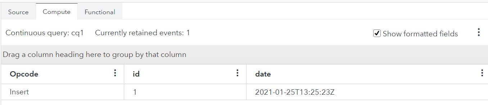
  <figcaption><i>Fig 34. Output from Compute window implementing today function</i></figcaption>
</figure>

- **date** field is Date type which implements the following expression:  
`today()`

The corresponding output from Functional window is as below:
<figure align="center">
  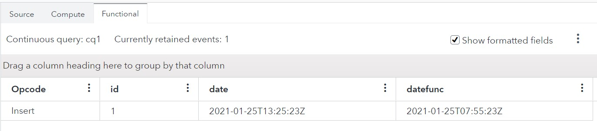
  <figcaption><i>Fig 35. Output from Functional window for the above input</i></figcaption>
</figure>

- **date** is Date type coming from the Compute window
- **datefunc** is the Date type which implements the following function  
`timeCurrent()`

Note the mismatch between the times. This is because today function returns the current date and time value in my current timezone whereas ESP takes the UTC timezone timestamp.

The output from Functional window if Compute window expression is todaygmt() is as below:
<figure align="center">
  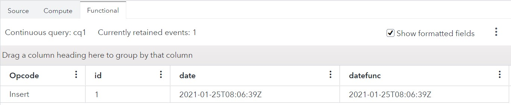
  <figcaption><i>Fig 36. Output from Functional window with Compute window expression as todaygmt()</i></figcaption>
</figure>

- **date** is Date type coming from the Compute window which implements todaygmt() function
- **datefunc** is the Date type which implements the following function  
`timeCurrent()`

Note that both the times are same in this case.

## Calculations Involving Dates
While doing calculations involving dates keep in mind how each internal engine/language handles date and time in ESP as seen above. Here we will show an example of finding the difference between two timestamps and using the Functions in Functional window, Expression engine in Compute Window and MAS DS2 in Calculate window to do the same.

### Model and Output
The model used here for illustration is as below:
<figure align="center">
  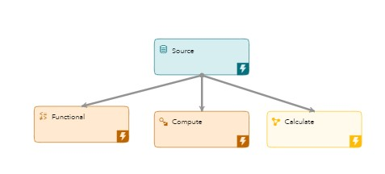
  <figcaption><i>Fig 37. Model for date based calculation example</i></figcaption>
</figure>

You can get the corresponding model for illustration here:  
https://github.com/sassoftware/iot-how-to-handle-dates-times-ESP/tree/main/models/Project_TimeDiff.xml    
 
The output from Source Window is as below:
<figure align="center">
  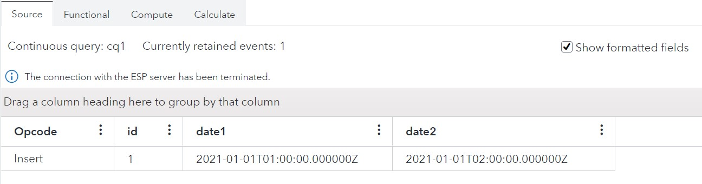
  <figcaption><i>Fig 38. Output from Source window</i></figcaption>
</figure>

- **date1** and **date2** are two Stamp type fields having the following

The output from the Functional window is as below:
<figure align="center">
  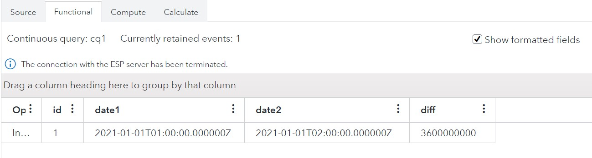
  <figcaption><i>Fig 39. Output from Functional window</i></figcaption>
</figure>

- **date1** and **date2** are coming from the Source window
- **diff** is the difference between the two dates in Int64 which in a way is the difference in microseconds as Stamp types are microseconds since epoch. Diff uses the following function  
`diff(date1-date2)`

The output from the Compute window using the Expression engine is as below:
<figure align="center">
  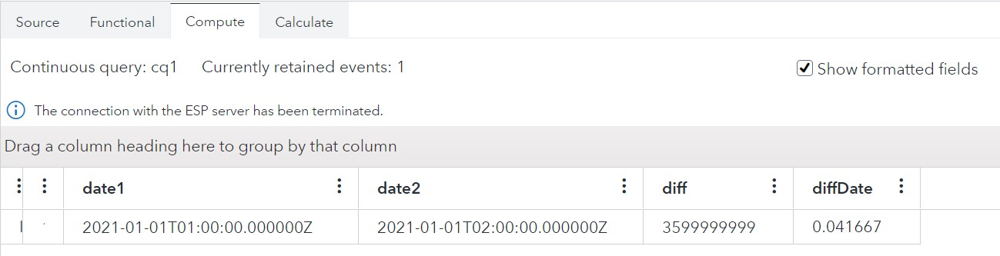
  <figcaption><i>Fig 40. Output from Expression engine through Compute window</i></figcaption>
</figure>

- **date1** and **date2** are same as input event from Source window.
- **diff** is the numeric value of the difference between date2 and date1 multiplied by number of microseconds in a day. You may notice that its not exactly correct as we have seen earlier that rounding off can cause data loss. The expression used in this case is  
`(date2-date1)*86400*1000000`
- **diffDate** is the actual difference between the dates. Its in fraction because hours are represented as 1/24 of a day in the expression engine. The expression used in this case is  
`date2-date1`

The output from the Calculate window using DS2 code through MAS is as follows:
<figure align="center">
  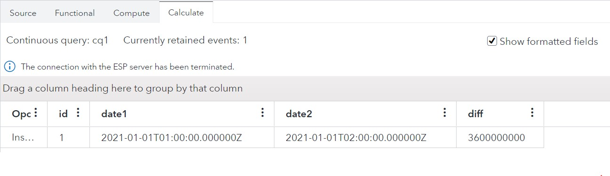
  <figcaption><i>Fig 41. Output from Calculate window through DS2 code</i></figcaption>
</figure>

- **date1** and **date2** are same as the fields in Source window.
- **diff** is the difference between date2 and date1 as calculated in the DS2 code. The DS2 code used in this case is as follows:  
```
ds2_options sas;
	package loadResults/overwrite=yes;
method getResultSet(bigint date1, bigint date2, in_out bigint diff);
		diff = date2-date1;
end;
endpackage;
```

You may notice that the difference is same as Functional window as the dates are managed as microseconds only even though with different epochs.

## Best practices
Below are some of the best practices that you can follow while working with dates and times in ESP based upon whatever we have seen in the above sections. These are merely guidelines, but your actual implementations will depend on your requirements and the data.

- If you don’t require to process the Date or Time fields in your ESP project, then keep the format same as input data. For example, if the input data has date as string and you simply need to pass through this then keep it as string to avoid any issue with conversions.
- If date time processing is required, then try to convert the date time string formats into ESP Date Time data types through the dateformat property in connectors and adapters. This way the fields will be consistent throughout the model. These fields can then be used for time based operations like Retentions in ESP.
- As far as possible handle the date time fields through the Functional window as it directly works on the underlying numeric types, so no data conversion happens.
- If you see any unexpected Date or Stamp formatted value in ESP Studio, then try to check the corresponding underlying numeric unformatted values. You can view that by unchecking the “Show formatted fields” option at the top right corner of the Test Result tab.
<figure align="center">
  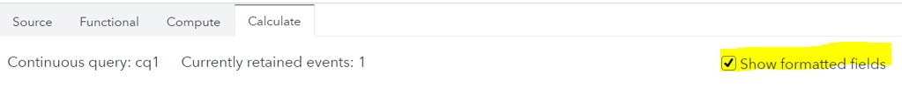
  <figcaption><i>Fig 42. Select/deselect formatted date and timestamps</i></figcaption>
</figure>

## Conclusion
Working with Dates and Times is a common requirement in streaming data which almost every time will have a timestamp associated with it. This document presented various scenarios that you can come across when processing streaming data containing date and time information and how to handle such type of data. 

If you have any queries, then please reach out to:  
Joydeep Bhattacharya (Joydeep.Bhattacharya@sas.com)  
Frédéric Combaneyre(Frederic.Combaneyre@sas.com)

## Contributing

> We welcome your contributions! Please read [CONTRIBUTING.md](CONTRIBUTING.md) for details on how to submit contributions to this project. 

## License

> This project is licensed under the [Apache 2.0 License](LICENSE).

## Additional Resources

* [SAS Event Stream Processing 6.2 Documentation](https://go.documentation.sas.com/?cdcId=espcdc&cdcVersion=6.2&docsetId=espov&docsetTarget=home.htm&locale=en)

